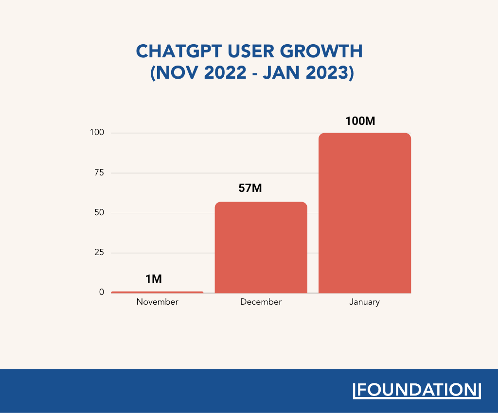
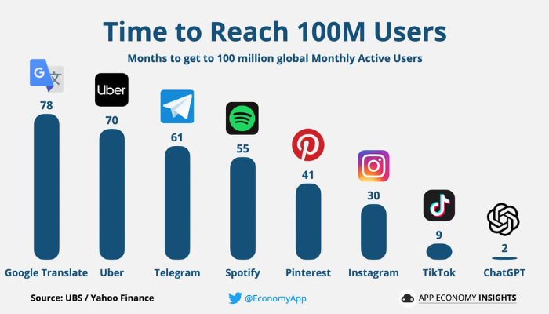
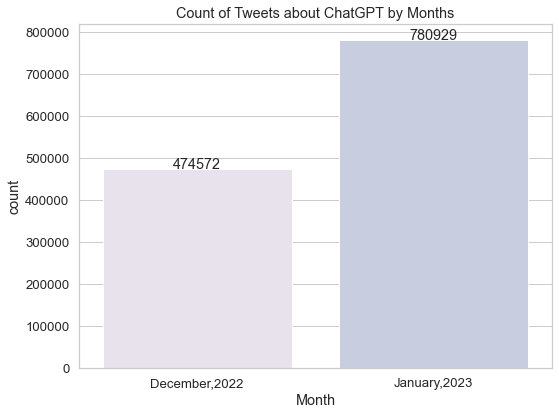
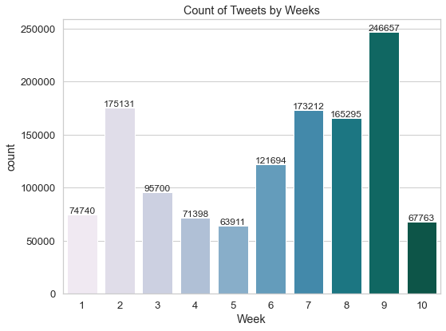

# Twitter-Sentiment-Analysis-about-ChatGPT
A quantitative study on over 1.25 million tweets about ChatGPT, employed data scrapping, data cleaning, EDA, topic modeling, and sentiment analysis.

## TABLE OF CONTENT
- [Background](#background)
- [Objective](#objective)
- [Methodology](#methodology)
  - [Tools](#tools)
  - [Data Collection](#data-collection)
  - [Data Preprocessing](#data-preprocessing)
  - [Data Modeling](#data-modeling)
- [Results](#results)
  - [Exploratory Data Analysis](#eda)
  - [Topic Modeling](#topic-modeling) 
  - [Sentiment Analysis](#sentiment-analysis) 
- [Conclusion](#conclusion)
- [References](#references)

## BACKGROUND
ChatGPT is an artificial intelligence chatbot developed by OpenAI and launched in November 2022. It is built on top of OpenAI's GPT-3 family of large language models and has been fine-tuned (an approach to transfer learning) using both supervised and reinforcement learning techniques. Given the advantages of ChatGPT over traditional chatbots, ChatGPT has attracted more than 1 million users in 5 days and 100 million users in 2 months after it was launched, leaving behind other popular online platforms such as Netflix, Facebook, and Instagram in terms of adoption rates. Some early adopters of ChatGPT believe that it will eventually obsolete several professions related to content creation. it has been demonstrated that ChatGPT is capable of producing high-quality responses to a variety of challenges, including solving coding challenges and generating accurate responses to exam queries.

 

## OBJECTIVE
Using a mixed-method approach, analyze tweets from December 2022 to January 2023 that mention ChatGPT and express diverse and unstructures opinions. Identify the main topics and sentiments of the conversations and examine perception of early ChatGPT users. We assert this identification will allow us to understand and assess ChatGPT's capability, effectiveness, and facing challenges. 

**Research Questions**
- **RQ1** What are the profile characterisitics of ChatGPT early users?
- **RQ2** What are the dominant topics that emerge from the tweets about ChatGPT?
- **RQ3** What are the sentiments that are associated with the tweets about ChatGPT?

## METHODOLOGY

### TOOLS
<table style="width:100%">
  <tr>
    <th>Task</th>
    <th>Technique Description</th> 
    <th>Tools/Packages Used</th>
  </tr>
  <tr>
    <td>Data Collection</td>
    <td>Scraping tweets from Twitter </td> 
    <td>snscrape</td>
  </tr>
  <tr>
    <td>Data Preprocessing</td>
    <td>Duplication removal, lowercasing, noise removal (punctuation, stopwords, URLs, @users), lemmatization</td> 
    <td>re, NLTK, pandas, numpy</td>
  </tr>
  <tr>
    <td>Feature Engineering</td>
    <td>Retrieving geographical info from a user's profile location; 
      retrieving datetime info from tweet timestamps </td> 
    <td>geopy, datetime</td>
  </tr>
  <tr>
    <td>Topic Modeling</td>
    <td>Identifying topics using the Latent Dirichlet Allocation (LDA) modelling</td> 
    <td>pyLDAvis, gensim</td>
  </tr>
  <tr>
    <td>Sentiment Analysis</td>
    <td>Quantitative sentiment analysis of each topic via rule-based and deep learning based model</td> 
    <td>VADER, roBERTa, scipy, torch</td>
  </tr>
  <tr>
    <td>Data Visualization</td>
    <td>Multi-attribute plots</td> 
    <td>matplotlib, seaborn, wordcloud, PowerBI</td>
  </tr>
  <tr>
    <td>Environments & Platforms</td>
    <td> </td> 
    <td>Google Colab, Jupyter Notebook, Twitter</td>
  </tr>
</table> 

### DATA-COLLECTION
<table style="width:100%">
  <tr>
    <th>Method</th>
    <th>Notes</th> 
  </tr>
  <tr>
    <td>Tweepy</td>
    <td>3200 tweets; no historical data</td> 
  </tr>
  <tr>
    <td>GetOldTweets3</td>
    <td>Twitter has removed the endpoint the GetOldTweets3 uses </td> 
  </tr>
  <tr>
    <td>Twint</td>
    <td>Twitter throws a more strict device + IP-ban after a certain amount of queries</td> 
  </tr>
  <tr>
    <td><b>snscrape</b></td>
    <td><b>Scrapped 1.25M tweets - 832,924 English tweets</b></td> 
  </tr>
</table>

<h4> Data Collection: Identifying ChatGPT Content </h4>

<li>Package used: snscrape</li>
<li>Language: English</li>
<li>Keywords: ChatGPT</li>
<li>Timeframe: December 1, 2022 to January 31, 2023</li>
<li>Features: User ID, User Name, User Verification, User Location, User Followers, Tweet Text, Posted Timestamp, and Posed Language</li>
<li>Number of tweets collected = 1,255,518</li>
<li>December - 474,572 tweets | January - 780,946 tweets</li>

### DATA-PREPROCESSING
<b> Data Cleaning </b> 
- Merged collected datasets into a single dataframe and removed duplicate tweets.
- Dropped 17 tweets that were missing timestamp values.
- Filled missing values in 'Location' column with the term "Unknown". 

**Feature Engineering**
- Utilized the geopy package to obtain the geographic information (specifically, the country) from the profile location associated with each user..
- Extracted both the date posted and the week from the timestamp by means of the datetime package, subsequently discarding the timestamp column.

**English Tweet Text Preprocessing**
- Filtered English-tweets and saved them to a new dataframe.
- Converted all tweets that represented the same word in different cases (e.g. ChatGPT and CHATGPT) to the same lowercase form (e.g.chatgpt).
- Removed noise such as punctuation, URLs, Twitter handles using the "re" library.
- Removed stopwords using the NLTK English stopwords list, and eliminated tokens that were too short (less than three characters) or too long (over 50 characters). 
- Exracted frequently occurring continuous sequence of 2 words (bigram) and 3 words (trigram) within the corpus.
- Performed WordNet-based lemmatization using the NLTK pacakge to transform each word into its base or dictionary form. 

### DATA-MODELING
**Unsupervised LDA**

The unsupervised Latent Dirichlet Allocation (LDA) modelling technique was applied to extract a set of key ChatGPT topics from the collected tweets. 
- Generated a dictionary and corpus containing all the tweet texts, filtering out extreme words with low/high appearing frequency of occurence (occuring in less than 10 tweets or more than 50% of tweets).
- Inplemented LDA using the LdaMulticore module in Gensim library. 
- Conducted a series of experiment by varing the number of topics (N) from 2 to 40, and obtained a relatively high coherence score for the range of 10 to 18 topics. 
- Executed LDA with N=10 and identified 10 topics based on the highly relevant tweets for each topic. 

**Sentiment Analysis**

Sentiment analysis is an approach to identifying the emotional tone behind textual data. Various algorithms (models) are available for sentiment analysis tasks, and each has its pros and cons, such as: 

- **Rule-based (lexicon-based):** Such kinds of models have their own dictionaries (lexicons) of words or emojis with positive or negative weights. These algorithms count the number of positive and negative words in the given text. If the number of positives is more than the negatives, they return a positive sentiment. If both are equal, they return a neutral sentiment. Rules or dictionaries of words can be customized. And these kinds of algorithms do not require any model training.
- **Supervised Machine learning:** These algorithms are fed with many labeled text data until they can learn patterns or the essence of the statement instead of clearly defined rules. However, for this approach labeled data is required, which is not available in our study. 
- **Unsupervised Deep Learning:** Such kinds of algorithms are able to learn patterns through multiple layers from unstructured and unlabeled data to perform sentiment analysis using various learning mechanisms, e.g. self-attention.

In this study, we used both VADER (rule-based model) from the NLTK library and Twitter-roBERTa (deep learning based)from the TRANSFORMERS package to examine the early users' attitude towards ChatGPT.

## RESULTS
### EDA
**Tweets about ChatGPT over time**

- When ChatGPT was first released, there were approximately 250,000 tweets discussing it in the first two weeks leading up to December 11, 2022.
- The number of tweets mentioning ChatGPT in January 2023 was 1.65 times higher than the number of tweets in December 2022.
- Starting on January 2, 2023 (Week 6), there was a significant increase in the amount of tweets discussing ChatGPT.
- In week 9, the number of tweets related to ChatGPT reached its highest point in the past two monts (246,657). 

### TOPIC-MODELING
### SENTIMENT-ANALYSIS

## CONCLUSION

## REFERENCES
